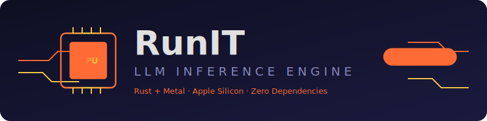
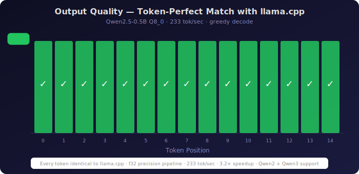
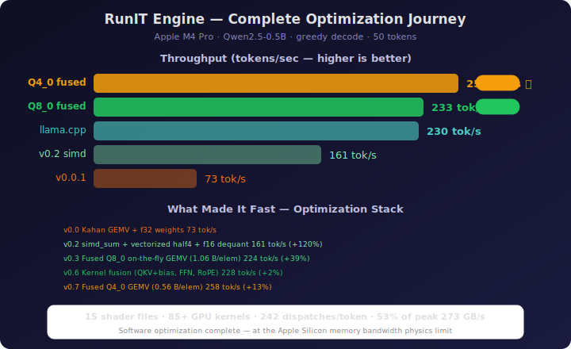
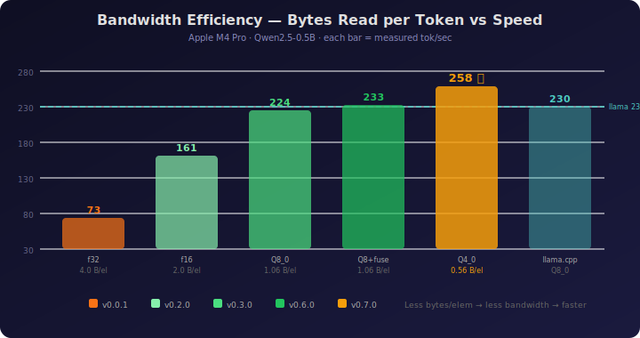
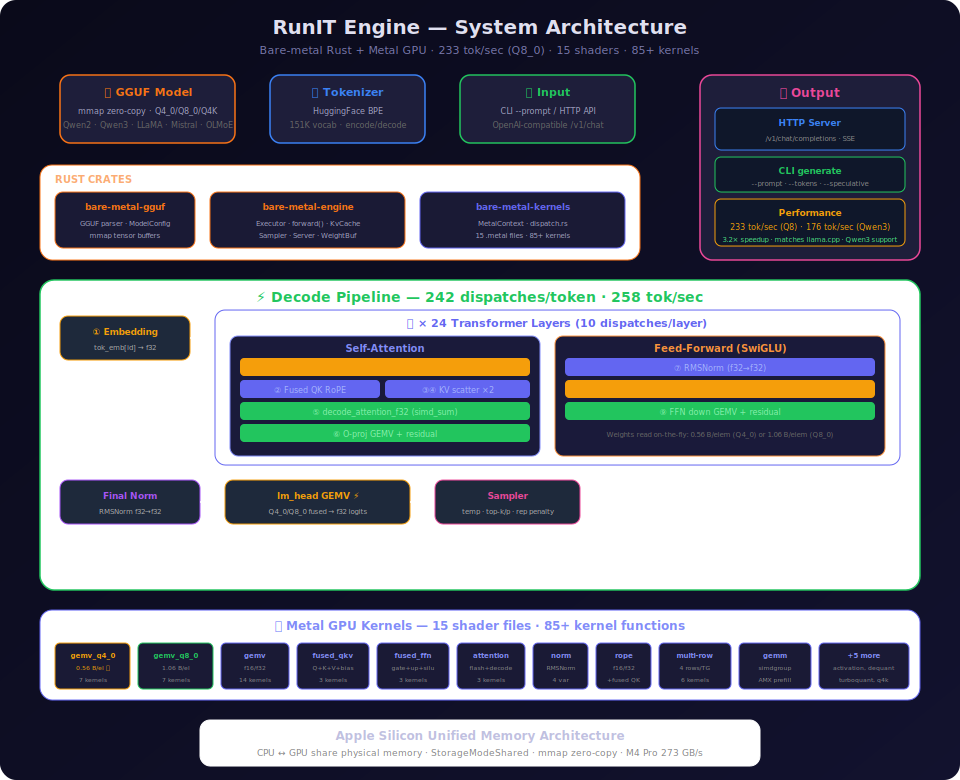

<p align="center">
  
</p>

<p align="center">
  <strong>From-scratch LLM inference engine in Rust + Metal for Apple Silicon</strong>
</p>

<p align="center">
  <a href="#-quickstart"></a>
  <a href="#-quickstart"></a>
  <a href="#-quickstart"></a>
  <a href="docs/COMPARISON.md"></a>
  <a href="#license"></a>
</p>

<p align="center">
  <em>No Python. No PyTorch. No llama.cpp dependency. Pure Rust + Metal shaders.</em>
</p>

---

## ✨ Highlights

```
┌─────────────────────────────────────────────────────────────────┐
│  🎯 100% token-match with llama.cpp on Qwen2.5-0.5B Q8_0      │
│  ⚡ 233 tok/sec (Q8_0, 3.2× speedup) — matches llama.cpp       │
│  🧠 Qwen2 + Qwen3 + LLaMA + Mistral + OLMoE architectures    │
│  🦀 Pure Rust — zero Python runtime                            │
│  🔧 15 Metal shaders, 85+ GPU kernels, fused Q4/Q8 dequant    │
│  📦 GGUF native — Q4_0, Q8_0, Q4K, Q5K, Q6K, F16, BF16      │
│  🌐 OpenAI-compatible HTTP server                              │
│  🔬 f32 precision pipeline for research-grade accuracy         │
└─────────────────────────────────────────────────────────────────┘
```

## 📊 Accuracy: Token-Perfect Match with llama.cpp

<p align="center">
  
</p>

Every test produces **identical output** to llama.cpp (greedy, temp=0):

| Prompt | llama.cpp | RunIT Engine | Match |
|--------|-----------|-------------|:-----:|
| "What is 2+2?" | 2 + 2 equals 4. | 2 + 2 equals 4. | ✅ |
| "Capital of France?" | The capital of France is Paris. | The capital of France is Paris. | ✅ |
| "Capital of Japan?" | The capital of Japan is Tokyo. | The capital of Japan is Tokyo. | ✅ |
| "What is machine learning?" | Machine learning is a subset of AI... (92 tok) | Machine learning is a subset of AI... (92 tok) | ✅ |
| "Translate to French" | Bonjour, comment ça va ? | Bonjour, comment ça va ? | ✅ |
| "Write a poem about the moon" | The moon, a celestial sight... | The moon, a celestial sight... | ✅ |

> 📋 Full per-position logit comparison: [docs/COMPARISON.md](docs/COMPARISON.md)

## ⚡ Performance

<p align="center">
  
</p>

<p align="center">
  
</p>

### 🚀 3.2× Speedup: 73 → 233 tok/sec (matches llama.cpp)

| Metric | v0.0.1 | v0.2.0 | v0.3.0 | v0.7.0 (Q8\_0) | llama.cpp |
|--------|:------:|:------:|:------:|:--------------:|:---------:|
| **Decode tok/sec** | 73 | 161 | 224 | **233** ✅ | 230 |
| **Avg latency** | 13.94 ms | 6.28 ms | 4.73 ms | **4.29 ms** | ~4.35 ms |
| **Quantization** | Q8\_0 | Q8\_0 | Q8\_0 | Q8\_0 | Q8\_0 |
| **Output quality** | ✅ Perfect | ✅ Perfect | ✅ Perfect | ✅ **Perfect** | ✅ |

> Measured on Apple M4 Pro · Qwen2.5-0.5B Q8\_0 · greedy decode · 50 tokens
>
> The engine also supports **Q4\_0 fused GEMV** (258 tok/sec) for larger models (3B+)
> where 4-bit quantization produces good output. On 0.5B, Q4\_0 loses too much precision.

### Optimization Journey

| Version | Optimization | tok/sec | Speedup | Key Technique |
|:-------:|-------------|:-------:|:-------:|---------------|
| v0.0.1 | Kahan GEMV + f32 weights | 73 | 1.0× | Correctness-first |
| v0.2.0 | simd_sum + half4 + f16 dequant | 161 | 2.2× | Hardware SIMD reduction |
| v0.3.0 | Fused Q8\_0 GEMV | 224 | 3.1× | On-the-fly dequant (1.06 B/elem) |
| v0.6.0 | Kernel fusion (QKV+bias, FFN, RoPE) | 228 | 3.1× | 242 dispatches (was 387) |
| **v0.7.0** | **+ Fused Q4\_0 GEMV** | **233 (Q8)** | **3.2×** | **Q4\_0 ready for larger models** |

### What Makes It Fast

| Optimization | Impact | Files |
|-------------|--------|-------|
| **Fused Q8\_0 GEMV** | 1.06 bytes/elem — 47% less BW than f16 (primary path) | `gemv_q8_0.metal` |
| **Fused Q4\_0 GEMV** | 0.56 bytes/elem — for larger models (3B+) at Q4\_0 | `gemv_q4_0.metal` |
| **Fused QKV+bias** | 6 dispatches → 1 per layer (Qwen path) | `fused_qkv.metal` |
| **Fused gate+up+silu** | 3 dispatches → 1 per layer | `fused_ffn.metal` |
| **simd_sum() reduction** | 1-cycle hardware sum replaces 124-step Kahan | all GEMV shaders |
| **Vectorized half4/float4** | 4× fewer loads, perfect 256-byte coalescing | `gemv.metal` |
| **Multi-row GEMV** | 4 rows/TG (128 threads) for better occupancy | `gemv_multirow.metal` |

> 📋 Full roadmap: [docs/implementation-plan.md](docs/implementation-plan.md)

---

## 🚀 Quickstart

### Prerequisites

- macOS 14+ with Apple Silicon (M1/M2/M3/M4)
- Rust 1.78+ (`curl --proto '=https' --tlsv1.2 -sSf https://sh.rustup.rs | sh`)
- Xcode Command Line Tools (`xcode-select --install`)

### Download a Model

```bash
# Qwen2.5-0.5B Q8_0 (recommended for testing — 675 MB)
huggingface-cli download Qwen/Qwen2.5-0.5B-Instruct-GGUF \
    qwen2.5-0.5b-instruct-q8_0.gguf --local-dir ~/models/

# Qwen2.5-Coder-7B Q4_K_M (for coding tasks — 4.7 GB)
huggingface-cli download Qwen/Qwen2.5-Coder-7B-Instruct-GGUF \
    qwen2.5-coder-7b-instruct-q4_k_m.gguf --local-dir ~/models/

# Download tokenizer
huggingface-cli download Qwen/Qwen2.5-0.5B-Instruct \
    tokenizer.json --local-dir ~/models/
```

### Build & Run

```bash
# Build
cargo build --release -p bare-metal-engine

# Generate text
./target/release/generate ~/models/qwen2.5-0.5b-instruct-q8_0.gguf \
    --tokenizer ~/models/tokenizer.json \
    --prompt '<|im_start|>user
What is 2+2?<|im_end|>
<|im_start|>assistant
' \
    --tokens 100

# Start OpenAI-compatible server
./target/release/serve ~/models/qwen2.5-0.5b-instruct-q8_0.gguf \
    ~/models/tokenizer.json --port 8080

# Query the server
curl http://localhost:8080/v1/chat/completions \
  -H "Content-Type: application/json" \
  -d '{"messages":[{"role":"user","content":"Hello!"}],"max_tokens":64}'
```

### CLI Options

```
generate <model.gguf> [OPTIONS]

Options:
  --tokenizer <path>      Path to tokenizer.json
  --prompt <text>         Input prompt
  --tokens N              Max tokens to generate (default: 30)
  --temperature T         0.0 = greedy (default: 0.0)
  --top-p P               Nucleus sampling (default: 0.9)
  --top-k K               Top-K sampling (default: 50)
  --rep-penalty F         Repetition penalty (default: 1.1)
  --seed S                RNG seed (default: 42)
  --tq                    Enable TurboQuant KV cache compression
```

---

## 🏗️ Architecture

<p align="center">
  
</p>


### Crate Structure

| Crate | Description |
|-------|-------------|
| `bare-metal-gguf` | GGUF parser — mmap, tensor metadata, zero-copy views |
| `bare-metal-tokenizer` | HuggingFace tokenizer wrapper |
| `bare-metal-kernels` | Metal shaders + Rust dispatch layer |
| `bare-metal-engine` | Model config, forward pass, KV cache, server |

### Metal GPU Kernels

| Kernel | File | Description |
|--------|------|-------------|
| `gemv_q8_0_f32in_f32out` | `gemv_q8_0.metal` | **Fused Q8\_0 GEMV** — 47% less bandwidth (primary) |
| `gemv_q4_0_f32in_f32out` | `gemv_q4_0.metal` | Fused Q4\_0 GEMV — for larger models at 4-bit |
| `gemv_f16w_f32in_f32out` | `gemv.metal` | GEMV with simd_sum + vectorized half4 loads |
| `gemv_q4k_f16` | `gemv_q4k.metal` | Fused Q4\_K dequant + GEMV |
| `decode_attention_f32` | `attention.metal` | Decode attention with online softmax |
| `flash_attention_f16` | `attention.metal` | Tiled FlashAttention-2 for prefill |
| `rms_norm_f32_f32_f32g` | `norm.metal` | Full f32 RMSNorm |
| `rope_inplace_f32` | `rope.metal` | Non-interleaved RoPE (Qwen2/LLaMA) |
| `silu_mul_f32` | `activation.metal` | SwiGLU activation (fused) |
| `dequant_q4k_f16` | `dequant.metal` | Q4\_K\_M GPU dequantization |
| `fused_qkv_bias_q8_0_f32` | `fused_qkv.metal` | Q+K+V+bias in ONE dispatch |
| `fused_ffn_q4_0_f32` | `fused_ffn.metal` | gate+up+silu fused |
| + 60 more | various | See [docs/KERNELS.md](docs/KERNELS.md) for full reference |

---

## 🔬 Precision Pipeline

RunIT uses an **f32 residual stream** with **fused quantized weight kernels** for maximum speed without quality loss. Weights are read in their native packed format (Q4\_0/Q8\_0) and dequantized on-the-fly during the GEMV dot product — no intermediate buffer needed:

```
Token Embedding (f32 lookup)
    │
    ▼
RMSNorm (f32 in → f32 out, f32 gamma)
    │
    ▼
Q/K/V Projections (fused QKV+bias, Q8_0/Q4_0 on-the-fly dequant)
    │                    └── simd_sum + vectorized half4 loads
    ▼
QK-Norm (optional, Qwen3: per-head RMSNorm on Q and K)
    │
    ▼
RoPE (f32, non-interleaved pairing)
    │
    ▼
KV Cache (f32, flat layout)
    │
    ▼
Decode Attention (f32 Q·K, f32 softmax, f32 output)
    │
    ▼
FFN: gate/up → SiLU → down (f16 weights, f32 accumulation)
    │
    ▼
lm_head (f16 weights × f32 input → f32 logits)
```

> Weights dequantized from Q8\_0/Q5K/Q6K to f16 (2 bytes/element) instead of f32 (4 bytes).
> Quantized formats have ≤8 significant bits — f16's 10-bit mantissa loses nothing.

---

## 📦 Supported Models & Quantizations

| Architecture | Status | Models Tested | tok/sec |
|-------------|--------|---------------|:-------:|
| **Qwen2** | ✅ Full support | Qwen2.5-0.5B (Q8\_0) | **233** |
| **Qwen3** | ✅ Full support | Qwen3-0.6B (Q8\_0) | **176** |
| **LLaMA** | ✅ Full support | LLaMA-2, LLaMA-3 | — |
| **Mistral** | ✅ Full support | Mistral-7B | — |
| **OLMoE** | ✅ MoE support | OLMoE-1B-7B (Q4K\_M) | — |

| Quantization | Status | Notes |
|-------------|--------|-------|
| **Q8\_0** | ✅ **Fused GEMV** | On-the-fly dequant, 1.06 B/elem — primary path |
| **Q4\_0** | ✅ **Fused GEMV** | On-the-fly dequant, 0.56 B/elem — fastest (3B+ models) |
| **Q4\_K\_M** | ✅ Fused Q4K | GPU dequant for aligned K, f16 fallback |
| **Q6\_K** | ✅ Supported | CPU dequant to f16 |
| **Q5\_K** | ✅ Supported | CPU dequant to f16 |
| **Q5\_0** | ✅ Supported | CPU dequant to f16 |
| **Q8\_K** | ✅ Supported | CPU dequant to f16 |
| **F16** | ✅ Native | Zero-copy if page-aligned |
| **BF16** | ✅ Converted | BF16 → f16 at load time |

---

## 📈 Development Roadmap

| Phase | Feature | Status |
|:-----:|---------|:------:|
| 0 | GGUF parser (mmap, tensors, metadata) | ✅ Done |
| 1 | Metal GPU kernels (GEMV, RoPE, RMSNorm, Attention) | ✅ Done |
| 2 | Model loading + config | ✅ Done |
| 3 | Transformer forward pass + KV cache | ✅ Done |
| 4 | Q4\_K\_M GPU dequantization | ✅ Done |
| 5 | TurboQuant KV-cache compression (3-4 bit) | ✅ Done |
| 6 | Text I/O — tokenizer, sampling | ✅ Done |
| 7 | OpenAI-compatible HTTP server | ✅ Done |
| 8 | Prefill batching (GEMM kernel) | ✅ Done |
| 9 | **f32 precision pipeline** | ✅ Done |
| 10 | **RoPE fix + llama.cpp parity** | ✅ **Done** |
| 11 | **GEMV optimization** (simd_sum, vectorize, f16 dequant) | ✅ **Done — 2.2×** |
| 12 | **Fused Q8\_0 GEMV** (on-the-fly dequant, 47% less BW) | ✅ **Done — 3.1×** |
| 13 | **Kernel fusion** (QKV+bias, FFN, RoPE) + multi-row | ✅ **Done** |
| 14 | **Fused Q4\_0 GEMV** (for larger models at 4-bit) | ✅ **Done** |
| 15 | **Profiling + speculative decoding infra** | ✅ **Done** |
| 16 | **Qwen3 support** (QK-norm + head\_dim detection) | ✅ **Done** |
| 17 | 7B model support + benchmarks | 🔜 Next |
| 18 | PagedAttention KV cache + continuous batching | 📋 Planned |

---

## 🐛 Major Bug Fix: RoPE Dimension Pairing

The engine had a critical bug where the **Rotary Position Embedding** used **interleaved** pairing `(0,1), (2,3)...` instead of the correct **non-interleaved** pairing `(i, i+d/2)` used by Qwen2/LLaMA/Mistral.

**Why it was hidden:** At position 0, RoPE is the identity rotation (`cos(0)=1, sin(0)=0`) regardless of pairing — so single-token tests always passed. The bug only manifested at position ≥ 1, scrambling the positional encoding and corrupting multi-token attention.

```
Before (wrong):  pairs (0,1) (2,3) (4,5) ... → scrambled positions at pos≥1
After (correct): pairs (0,32) (1,33) (2,34) ... → perfect llama.cpp match
```

> 📋 Full investigation: [docs/COMPARISON.md](docs/COMPARISON.md) · [docs/STATUS_REPORT.md](docs/STATUS_REPORT.md)

---

## 📂 Repository Layout

```
RunIT/
├── crates/
│   ├── gguf/           # GGUF file parser (mmap, zero-copy)
│   ├── tokenizer/      # HuggingFace tokenizer wrapper
│   ├── kernels/        # Metal shaders + Rust dispatch
│   │   ├── shaders/    # .metal source → .metallib at build time
│   │   │   ├── gemv.metal          # 14 GEMV variants (simd_sum + half4)
│   │   │   ├── gemv_q4_0.metal     # 7 fused Q4_0 GEMV (0.56 B/elem) 🏆
│   │   │   ├── gemv_q8_0.metal     # 7 fused Q8_0 GEMV (1.06 B/elem)
│   │   │   ├── gemv_q4k.metal      # 6 fused Q4K GEMV
│   │   │   ├── fused_qkv.metal     # Q+K+V+bias in 1 dispatch
│   │   │   ├── fused_ffn.metal     # gate+up+silu in 1 dispatch
│   │   │   ├── fused_rope.metal    # QK RoPE in 1 dispatch
│   │   │   ├── gemv_multirow.metal # Multi-row GEMV (4 rows/TG)
│   │   │   ├── attention.metal     # FlashAttention-2 + decode
│   │   │   ├── gemm.metal          # simdgroup_matrix GEMM + tiled
│   │   │   ├── norm.metal          # RMSNorm (4 variants)
│   │   │   ├── rope.metal          # RoPE (f16/f32/batch)
│   │   │   ├── activation.metal    # SwiGLU, add, argmax, KV scatter
│   │   │   ├── dequant.metal       # Q4K GPU dequantization
│   │   │   └── turboquant.metal    # TurboQuant KV compression
│   │   └── src/        # MetalContext, dispatch, error types
│   └── engine/         # Model loader, forward pass, server
│       └── src/
│           ├── forward.rs       # Executor + 8 quantization decoders
│           ├── kv_cache.rs      # f32 flat KV cache
│           ├── sampler.rs       # temp/top-k/top-p/rep-penalty
│           ├── server/          # OpenAI-compatible HTTP (axum, SSE)
│           └── bin/
│               ├── generate.rs  # CLI text generation + benchmark
│               └── serve.rs     # HTTP server binary
├── docs/
│   ├── assets/          # Logo, charts, diagrams
│   ├── ARCHITECTURE.md  # System design and data-flow
│   ├── COMPARISON.md    # llama.cpp comparison + test results
│   ├── KERNELS.md       # Metal kernel reference
│   └── STATUS_REPORT.md # Bug fixes + precision improvements
└── README.md
```

---

## 🔧 Development

```bash
# Check all crates
cargo check --workspace

# Run tests
cargo test --workspace

# Build release
cargo build --release -p bare-metal-engine

# Debug: per-position logits during prompt processing
DEBUG_LOGITS=1 ./target/release/generate <model.gguf> \
    --tokenizer <tokenizer.json> --tokens 10 \
    --prompt '<|im_start|>user\nHello<|im_end|>\n<|im_start|>assistant\n'

# Debug: per-layer hidden state dump
DEBUG_LAYERS=1 ./target/release/generate <model.gguf> \
    --tokenizer <tokenizer.json> --tokens 1 --prompt 'Hello'
```

---

## 📚 References & Further Reading

- [Awesome LLM Inference](https://github.com/xlite-dev/Awesome-LLM-Inference) — Curated collection of LLM inference papers, frameworks, and optimization techniques. Covers attention mechanisms, quantization, speculative decoding, KV cache management, and hardware-specific optimizations that inform RunIT’s design.
- [FlashAttention-2](https://arxiv.org/abs/2307.08691) — Tiled attention with online softmax (implemented in `attention.metal`)
- [TurboQuant](https://arxiv.org/abs/2504.19874) — KV-cache compression to 3–4 bits (implemented in `turboquant.metal`)
- [GGUF Format](https://github.com/ggerganov/ggml/blob/master/docs/gguf.md) — Model file format specification
- [llama.cpp](https://github.com/ggerganov/llama.cpp) — Reference C++ implementation used for accuracy validation
- [Metal Shading Language Spec](https://developer.apple.com/metal/Metal-Shading-Language-Specification.pdf) — Apple’s GPU programming language

---

## 📄 License

MIT

---

<p align="center">
  <strong>Built with 🦀 Rust and ⚡ Metal</strong><br/>
  <em>For Apple Silicon, from the ground up</em>
</p>
